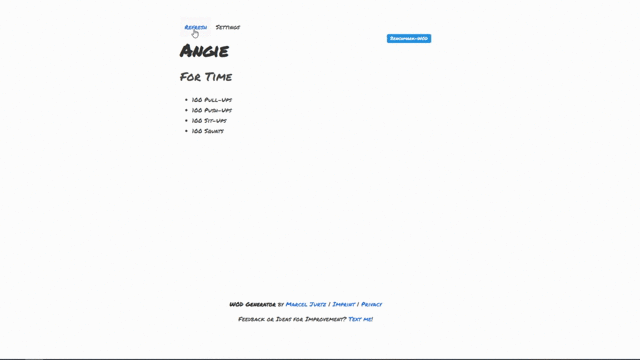

# Crossfit Workout Generator

I always had the problem that I was looking for WODs to do at home, but wasn't really motivated to sort out any workouts from catalogs by equipment that's available to me.
This is currently a WIP to take that work off of me. There's a [live demo](http://wod-gen.herokuapp.com/) available. Right now, the random selection of workouts from the catalog work,
the filtering by equipment is not yet implemented. Also, ATM I only have a few benchmark WODs implemented. More to come. Promised.

## TODO / Roadmap / Open Ideas

* Filter WOD by Equipment
* Blacklist for specific excercises
* Implement permalinks to api for sharing wods
* Export-Option as Image (?) with Permalink for Social Media Sharing + Customizable Background
* Ignore current WOD when fetching a new random one
